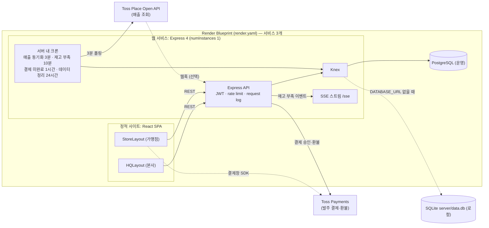
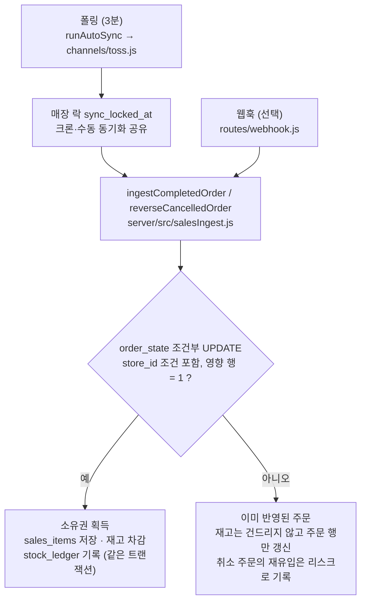
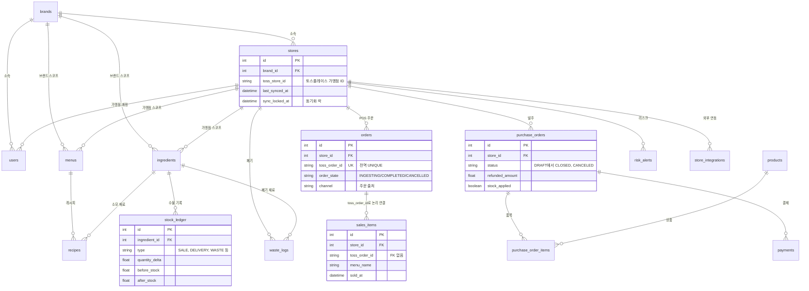

<div align="center">

# franchise-inventory-system

**프랜차이즈 재고·발주 관리 시스템**

POS 매출을 자동 수집해 레시피대로 재료 재고를 차감하고, 본사–가맹점 발주·결제·납품·정산과 운영 리스크 알림을 한곳에서 관리한다.

        

[핵심 기술 과제](#핵심-기술-과제와-해결) · [아키텍처](#아키텍처) · [실행 방법](#실행-방법) · [회고](#회고와-개선-과제)

</div>

| 기간 | 역할 | 규모 | 테스트 | 배포 |
|:---:|:---:|:---:|:---:|:---:|
| 2026.06 – 2026.09 | 1인 · 설계·구현·테스트·배포 전담 | 원본 커밋 229 · 리스크 알림 14종 | node:test 15파일 94케이스 · GitHub Actions CI | Render |

> [!IMPORTANT]
> **문제** — POS 매출이 재고에 누락되거나 두 번 반영되면 화면은 멀쩡한 채 재고와 정산 수치가 조용히 틀어진다.
>
> **해결** — 폴링과 웹훅이 반영 로직 하나를 공유하고, 조건부 UPDATE의 영향 행 수로 주문·환불의 소유권을 선점해 중복을 막으며, 시스템 실패는 리스크 알림으로 올린다.
>
> **내 역할** — 1인 프로젝트로 설계·구현·테스트·배포를 전담했다.

## 프로젝트 개요

### 배경

본사(HQ)와 가맹점(Store)이 함께 쓰는 재고·발주 시스템이다. 가맹점의 POS(토스플레이스) 매출이 들어오면 메뉴별 레시피에 따라 재료 재고가 줄고, 가맹점은 본사 상품 카탈로그에서 발주서를 만들어 본사의 검수·결제·배송·납품 절차를 거친다. 전체 사이클은 다섯 단계다.

1. **POS 매출 유입**: 3분마다 토스플레이스 주문을 폴링해 `orders`(주문 원본)와 `sales_items`(메뉴별 판매)에 저장하고, `recipes`에 따라 `ingredients` 재고를 차감한다. 웹훅은 선택 사항이다.
2. **재고 부족·리스크 감지**: 크론이 재고 부족(10분)과 결제 미완료(1시간)를 점검해 `risk_alerts`에 기록한다.
3. **가맹점 발주**: 가맹점이 `products` 카탈로그에서 담아 발주서(`purchase_orders`, `purchase_order_items`)를 만든다.
4. **본사 검수·결제·배송**: 본사가 수량 조정·품절 처리를 하면 가맹점에 `needs_attention` 플래그로 알리고, 결제는 토스페이먼츠로 진행한다.
5. **납품·수령확인**: `DELIVERED` 처리 시 재료 재고가 자동으로 늘고, 가맹점이 수령확인 또는 이상신고를 남긴다.

### 해결한 문제

- 재고 차감이 웹훅 경로에만 있어 웹훅을 등록하지 않은 가맹점은 매출만 쌓이고 재고가 줄지 않던 구조를, 폴링과 웹훅이 공유하는 반영 로직 하나(`server/src/salesIngest.js`)로 통합했다.
- 폴링이 같은 주문을 3분마다 다시 보는 환경에서 웹훅·폴링·수동 동기화가 겹쳐도 재고가 이중으로 차감되거나 복구되지 않게 했다(과제 1, 2).
- 동시 환불 요청이 토스 취소를 두 번 내보내는 문제를 막았다(과제 3).
- 로컬(SQLite)에서만 조용히 틀리던 시각 비교와 KST 일별 집계 경계를 바로잡고, 두 방언을 CI에서 모두 돌린다(과제 4).
- 토스 자격증명을 AES-256-GCM으로 암호화하고, 키를 나중에 추가해도 남은 평문을 자동으로 암호화한다(과제 5).
- 동기화 실패, 웹훅 거부, 환불 불일치처럼 콘솔 로그로만 남던 시스템 실패를 `risk_alerts`로 올려 운영자가 보는 화면에 띄웠다.

## 팀 구성과 내 역할

| 항목 | 내용 |
|---|---|
| 기간 | 2026-06-23 ~ 2026-09-09 |
| 인원 | 1명 — 설계·구현·테스트·배포 전담 |
| 원본 커밋 | 229개 |
| 내 역할 | 데이터 모델·API·권한 설계, 서버(Express, Knex)와 클라이언트(React) 구현, 매출 반영·환불·동기화의 동시성 제어, SQLite·Postgres 이중 방언 대응, 테스트 15파일 94케이스와 GitHub Actions CI, Render 배포 설정 |

구현 과정에서 AI 코딩 도구(Claude, Codex)를 활용했다. 요구사항 정리, 설계 결정, 코드 리뷰, 테스트 설계와 스테이징 검증은 직접 했다. 실제 운영 환경에서 돌려 본 적은 아직 없다([server/scripts/preflight.js](server/scripts/preflight.js) 머리 주석).

공개용으로 정리하면서 커밋 히스토리를 새로 시작했다. 원본 저장소 커밋 229개(2026-06-23 ~ 2026-09-09). 문서 속 커밋 해시는 원본 저장소 기준이다.

## 주요 기능

### 본사

- **분석·정산**: 대시보드, 매출 분석, 정산 리포트, 가맹점 순위.
- **기준 정보**: 가맹점, 사용자, 발주 상품, 재료, 메뉴(레시피 포함)를 관리한다. 메뉴 매핑은 POS 메뉴를 토스 메뉴 ID 또는 이름으로 매칭하고, 표준 메뉴 연결과 세트 구성을 지원한다. 등록되지 않은 메뉴가 팔리면 메뉴를 자동 생성하며, 레시피가 없어 재고가 차감되지 않으면 `MENU_UNMATCHED` 리스크를 남긴다.
- **본사 발주 관리**: 발주서 검수, 수량 조정, 품절·대체 처리, 상태 전이, 결제 후 환불(전액, 금액 지정, 선택 품목), 검수 이상신고 처리.
- **사입 이상 감지**: 매출과 레시피로 계산한 예상 소진량을 본사 발주량과 비교한다([server/src/routes/api.js](server/src/routes/api.js#L1361) 1361행 주변, `/purchase-anomalies`). 소모량 계산은 `server/src/menuResolver.js` 하나로 통일해 웹훅의 재고 차감과 같은 계산을 쓴다.
- **운영**: 리스크 알림, 내 업무(담당 가맹점의 검토 대기, 확인 필요, 미해결 리스크, 수령 이상 건수 집계), 공지, 변경 이력(감사 로그, `SUPER_ADMIN`·`HQ_ADMIN` 전용).
- **가맹점을 선택한 뒤**: 대시보드와 결제 내역, 재료, 메뉴와 레시피, 폐기 내역, 실사 재고 조정, 상품별 거래 수불(수불부).

### 가맹점

- **발주하기**: 상품 카탈로그에서 담아 발주서를 작성하고 임시저장한다. 자주 쓰는 구성은 정기 발주 템플릿으로 저장해 불러온다. 결제는 토스페이먼츠 결제창(카드)으로 진행한다.
- **수령확인**: 납품된 발주서에 수령확인 또는 이상신고를 남긴다.
- **재고**: 재고 확인, 폐기 입력, 실사 재고 조정.
- **알림**: 재고 부족 팝업, 공지 배너, 발주 변경 알림 배너.

### 역할과 권한

역할은 6종(`SUPER_ADMIN`, `HQ_ADMIN`, `HQ_LOGISTICS`, `HQ_ACCOUNTING`, `STORE_OWNER`, `STORE_STAFF`)이고, 권한 그룹 `ADMIN_ROLES`, `LOGISTICS_ROLES`, `HQ_ROLES`, `STORE_ROLES`는 `server/src/middleware/auth.js`에 있다. 그룹별 범위표는 [docs/architecture.md](docs/architecture.md#3-핵심-도메인-개념) 3절에 있다.

JWT에는 `id`, `role`, `brand_id`, `store_id`가 들어가지만, `requireAuth`가 매 요청마다 계정 활성 여부와 역할·소속을 DB에서 다시 읽는다. 발주 상태는 `DRAFT`에서 `CLOSED`까지 정해진 순서로 흐르고, 허용 전이는 `server/src/orderStatusFlow.js`의 `ALLOWED_TRANSITIONS`가 정본이다. `PAID` 이후에는 `CANCELED`로 전이할 수 없고 환불 경로로만 취소한다.

### 알림과 보안

- **리스크 알림 14종**: 장사 리스크 8종(과다 사입, 발주 부족, 매출감소·발주증가, 저회전 식자재, 폐기 과다, 유사 매장 대비 이상, 결제 미완료, 재고 부족)과 시스템 신호 6종(메뉴 미연결, 재고 음수, 웹훅 거부, 매출 동기화 실패, 환불 반영 불일치, 취소 주문 재유입 차단)이다.
- **SSE 실시간 알림**: 서버가 재고 부족 이벤트를 `/sse` 스트림으로 내보내며, 본사는 자기 브랜드 전체를, 가맹점은 자기 가맹점 이벤트만 받는다. `EventSource`가 헤더를 보낼 수 없어 JWT를 `?token=`으로 받으므로 요청 로그는 쿼리스트링을 통째로 잘라낸다. 현재 클라이언트는 이 스트림을 구독하지 않고 재고 부족 팝업이 3분 주기 조회로 갱신된다.
- **웹훅 검증**: `HMAC-SHA256(secret, "{timestamp}.{rawBody}")`에 `v1=` 접두사를 붙인 값을 `x-toss-signature`와 상수 시간 비교하고, 타임스탬프가 5분 넘게 어긋나면 401로 거부한다. 가맹점별 `webhook_secret`이 없으면 401이다([server/src/routes/webhook.js](server/src/routes/webhook.js#L106)).
- **운영 장치**: `GET /health`, graceful shutdown, IP당 분당 300건 rate limit, 로그인 5회 실패 시 잠금. `/health`의 판정 기준과 rate limit 제외 경로는 [docs/architecture.md](docs/architecture.md#2-아키텍처) 2절에 있다.

## 아키텍처



매출이 재고로 반영되는 경로는 폴링과 웹훅이 하나의 함수를 공유한다. 크론과 수동 동기화는 매장 단위 락을 나눠 쓰고, 웹훅은 락 없이 같은 함수로 들어온다.



서버 내 크론은 [server/src/index.js](server/src/index.js)에서 `setInterval`로 돈다. 각 크론은 겹쳐 돌지 않도록 `withOverlapGuard`로 감싸져 있다.

| 크론 | 주기 | 하는 일 | 위치 |
|---|---|---|---|
| 매출 동기화 | 3분 | `toss_store_id`가 있는 가맹점의 토스플레이스 주문 재수집 | [server/src/index.js:332](server/src/index.js#L332) |
| 재고 부족 점검 | 10분 | 재고 부족 리스크 기록 | [server/src/index.js:235](server/src/index.js#L235) |
| 결제 미완료 점검 | 1시간 | 결제 미완료 리스크 기록 | [server/src/index.js:225](server/src/index.js#L225) |
| 데이터 정리 | 24시간 | 처리 완료 리스크 180일, 발주 이력 365일, 알림 로그 90일 보관 후 삭제 | [server/src/index.js:358](server/src/index.js#L358) |

- **요청 경로**: 모든 요청은 요청 로그(쿼리스트링과 바디 미기록), IP당 분당 300건 rate limit, JWT 인증(`requireAuth`)을 거친다. 웹훅 raw body는 256kb, `express.json()`은 1mb로 제한한다.
- **클라이언트 분리**: 로그인한 역할에 따라 `HQLayout`과 `StoreLayout`이 완전히 분리된다(`client/src/App.jsx`의 `AppRoutes`).
- **단일 인스턴스**: 크론, 로그인 잠금, rate limit이 프로세스 메모리 기반이라 Render 서버는 `numInstances: 1`로 고정한다.

## 기술 스택과 선택 이유

| 영역 | 선택 | 선택 이유 |
|---|---|---|
| 서버 | Node.js 20, Express 4, Knex 3 | 로컬은 무설정 SQLite, 운영은 Postgres를 같은 코드로 쓴다. `DATABASE_URL` 유무로 방언을 고른다([server/src/db/schema.js](server/src/db/schema.js)). |
| DB | SQLite(로컬), PostgreSQL(운영) | 로컬은 설치 없이 바로 뜨고, 운영은 Render 관리형 Postgres를 쓴다. |
| 테스트 | `node:test` | 별도 의존성 없이 Express 라우터에 실제 HTTP 요청을 보내는 HTTP 계층까지 테스트한다. |
| CI | GitHub Actions 잡 3개 | SQLite 서버 테스트, Postgres 16 서버 테스트, 클라이언트 빌드를 따로 돌린다. SQLite에서만 돌리면 `forUpdate()`, `to_char`, timestamptz 비교 같은 방언 버그가 드러나지 않는다. |
| 클라이언트 | React 18, Vite 5, Tailwind CSS 4, Radix | 개발 서버 프록시로 `/api`, `/auth`, `/webhook`, `/sse`를 서버에 넘기고, 빌드는 벤더 청크를 분리해 메인 청크 크기를 줄인다([client/vite.config.js](client/vite.config.js)). |
| 외부 연동 | Toss Place Open API, Toss Payments | 매출은 토스플레이스에서 가져오고 발주 대금 결제·환불은 토스페이먼츠로 처리한다. 배달앱 주문도 토스플레이스 동기화에 함께 들어와 `channel` 값으로 구분한다. |
| 배포 | Render Blueprint | 서버(web), 클라이언트(static), Postgres 3개 서비스를 [render.yaml](render.yaml) 하나로 만든다. 서버는 메모리 기반 크론과 rate limit 때문에 `numInstances: 1`이다. |

## 핵심 기술 과제와 해결

| # | 과제 | 핵심 기법 |
|:-:|---|---|
| 1 | [폴링과 웹훅이 겹쳐도 매출을 한 번만 반영](#1-폴링과-웹훅이-겹쳐도-매출을-한-번만-반영) | `order_state` 조건부 UPDATE의 영향 행 수로 소유권 선점 · 선점과 이어지는 조회에 `store_id` 조건 · 취소 주문 재유입은 `SALES_REINGEST_BLOCKED` 리스크 |
| 2 | [동기화 시간창과 매장 단위 락](#2-동기화-시간창과-매장-단위-락) | 최소 2일 창을 항상 다시 훑기 · 실패해도 `last_synced_at`은 `now - 2일`까지만 전진 · `stores.sync_locked_at` 조건부 UPDATE 락(TTL 30분) |
| 3 | [환불 동시성](#3-환불-동시성) | 토스 호출 전에 `refunded_amount` 조건부 UPDATE로 선점 · 영향 행이 1이 아니면 409 거부 · 반영 실패 시 `REFUND_INCONSISTENT` 리스크 |
| 4 | [SQLite·Postgres 이중 방언과 KST 경계](#4-sqlitepostgres-이중-방언과-kst-경계) | `dbTime.js`로만 시각 비교 · 방언별 SQL로 일별 매출 버킷을 KST로 절단 · SQLite 잡과 Postgres 잡을 따로 돌리는 CI |
| 5 | [자격증명 AES-256-GCM 암호화와 자기 치유 백필](#5-자격증명-aes-256-gcm-암호화와-자기-치유-백필) | `enc:v1:` 접두사가 붙은 AES-256-GCM 암호문 · `isEncrypted`로 이중 암호화 방지 · 기동 시 `credentialsBackfill.js`가 남은 평문 암호화 |

### 1. 폴링과 웹훅이 겹쳐도 매출을 한 번만 반영

- **문제**: 폴링이 같은 주문을 3분마다 다시 보고 웹훅도 같은 주문을 보내므로, 존재 확인 `SELECT`로 분기하면 Postgres에서 두 트랜잭션이 모두 "처음 보는 주문"으로 판단해 재고가 이중으로 차감될 수 있었다. `orders.toss_order_id`는 전역 UNIQUE라 다른 가맹점의 같은 주문 ID와 부딪힐 가능성도 있었다.
- **해결**: `order_state` 조건부 UPDATE(`INGESTING`→`COMPLETED`, `COMPLETED`→`CANCELLED`)의 영향 행 수로 소유권을 선점하고, 소유권을 얻은 트랜잭션만 재고를 바꾼다. 선점 UPDATE와 이어지는 모든 조회에 `store_id`를 함께 건다. 처음부터 취소된 주문은 복구하지 않고, 이미 취소된 주문이 다시 `COMPLETED`로 내려오면 건너뛰고 `SALES_REINGEST_BLOCKED` 리스크를 남긴다. 소유권을 판정할 수 없으면 `throw`해 실패로 집계한다.
- **근거 코드**: [`ingestCompletedOrder` 상단 주석](server/src/salesIngest.js#L300), [`ingestCompletedOrder`](server/src/salesIngest.js#L314), [`reverseCancelledOrder`](server/src/salesIngest.js#L484), [server/test/sales-ingest.test.js](server/test/sales-ingest.test.js), [server/test/stock-transactions.test.js](server/test/stock-transactions.test.js)
- **검증/결과**: 같은 COMPLETED 웹훅과 같은 취소 웹훅이 동시에 2건 들어와도 재고가 1회분만 차감·복구되는지, 취소 뒤 COMPLETED가 재유입돼도 CANCELLED가 유지되는지, 가맹점 A·B에 같은 주문 ID가 와도 A의 주문 원본이 덮어써지지 않는지, 트랜잭션 중간 실패 시 재고와 주문이 함께 롤백되는지를 테스트한다.

### 2. 동기화 시간창과 매장 단위 락

- **문제**: 시간창을 "직전 동기화 이후"로만 잡으면 경계에 걸린 주문이 빠지고, 서버가 며칠 멈췄다 살아나면 그 구간이 훑어지지 않은 채 영구 누락된다. 수동 동기화와 크론이 같은 매장을 동시에 돌면 두 트랜잭션이 같은 주문을 각각 처음 보는 주문으로 판단한다.
- **해결**: `to = now`, `from = min(직전 동기화 시각 - 10분, now - 2일)`로 최소 2일 창을 항상 다시 훑는다(최초 동기화만 최근 5년). 실패하면 `last_synced_at`을 `now - 2일`까지만 전진시키고, 전진이 실제로 일어나면 연속 실패 횟수와 무관하게 즉시 `SYNC_FAILED` 리스크를 만든다. 크론과 수동 동기화는 `stores.sync_locked_at` 조건부 UPDATE(TTL 30분)로 같은 락을 공유한다.
- **근거 코드**: [`computeSyncWindow`](server/src/syncWindow.js#L18), [`computeFailureOutcome`](server/src/syncWindow.js#L31), [`acquireStoreSyncLock`](server/src/syncLock.js#L17), [`releaseStoreSyncLock`](server/src/syncLock.js#L28), [`runAutoSync`](server/src/index.js#L256), [server/test/sync-window.test.js](server/test/sync-window.test.js)
- **검증/결과**: 최초는 5년, 이후는 `min(last-10분, now-2일)`인 창 계산, 재시도 창이 앞으로 밀릴 때만 `advanced=true`가 되는 판정, 같은 매장의 두 번째 락 획득 실패와 올바른 stamp로 해제한 뒤의 재획득, 주문 3건 중 1건이 예외를 던져도 `{inserted:2, failed:1}`을 반환하는 동작을 테스트한다.

### 3. 환불 동시성

- **문제**: 토스 취소를 먼저 부르고 `refunded_amount`를 절대값으로 SET하면, 동시 요청 2건이 같은 기존 환불액을 읽어 토스 취소가 2회 나가고 장부는 1회분만 남으며 재고는 2회 원복된다. 결제가 끝난 발주서를 상태변경 API로 취소하면 환불 없이 상태만 `CANCELED`가 되어 정산에 매출로 남는 문제도 있었다.
- **해결**: 토스를 부르기 전에 `refunded_amount = 기대값` 조건부 UPDATE로 먼저 선점하고, 영향 행이 1이 아니면 409로 거부한다. 토스 호출이 실패하면 선점을 되돌린다. 토스 환불은 성공했는데 DB 반영이 실패하면 500과 함께 `REFUND_INCONSISTENT` 리스크를 남겨 수동 대사로 넘긴다. 결제 완료 발주서의 취소 가능 여부는 `cancelBlockReason` 하나로 판정하고 환불 경로로만 취소되게 했다.
- **근거 코드**: [`claimRefundAmount`](server/src/routes/orders.js#L688), [`releaseRefundClaim`](server/src/routes/orders.js#L697), [`cancelBlockReason`](server/src/routes/orders.js#L27), [server/test/refund-concurrency.test.js](server/test/refund-concurrency.test.js)
- **검증/결과**: 전액(`/refund`)과 품목별(`/refund-items`) 환불을 동시에 2건 보내도 토스 취소·`refunded_amount`·재고 원복이 1회만 반영되는지, 토스가 400을 주거나 네트워크 오류(502)가 나면 `refunded_amount`가 호출 전 값으로 돌아가고 재시도가 성공하는지, 토스 성공 뒤 DB 반영 실패 시 500과 `REFUND_INCONSISTENT`가 남는지를 테스트한다.

### 4. SQLite·Postgres 이중 방언과 KST 경계

- **문제**: `knex.fn.now()`가 채우는 시각은 SQLite에서 `YYYY-MM-DD HH:MM:SS`(UTC)로 저장돼 ISO 문자열과 직접 비교하면 항상 거짓이 된다. 운영 Postgres는 정상이라 로컬에서만 조용히 틀렸고, 재고 부족 알림의 1시간 쿨다운이 무력화되고 수불부 당일분이 빠지고 정리 크론이 아무것도 지우지 못했다. 서버 TZ가 UTC이면 "오늘"이 KST와 9시간 어긋난다. 컬럼·FK를 바꾸는 마이그레이션에서는 SQLite가 테이블을 재생성하며 자식 테이블이 CASCADE로 지워진 사고도 있었다.
- **해결**: DB가 채우는 시각과의 비교는 `dbTime.js`(`toDbTime`, `dbNow`, `dbTimeAgo`, `dbStartOfKstToday`)로만 하고 "오늘"은 항상 KST로 계산한다. 일별 매출 버킷은 SQL에서 방언별로 KST로 자른다(Postgres는 `AT TIME ZONE 'Asia/Seoul'`, SQLite는 `datetime(sold_at, '+9 hours')`). 컬럼과 FK를 바꾸는 마이그레이션에는 `exports.config = { transaction: false }`를 붙이는 규칙을 문서로 남겼고, CI는 SQLite 잡과 Postgres 잡(`postgres:16` 서비스 컨테이너, 직렬 실행)을 따로 돌린다.
- **근거 코드**: [`toDbTime`](server/src/dbTime.js#L15), [`kstDayRange`](server/src/dbTime.js#L31), [`dbStartOfKstToday`](server/src/dbTime.js#L42), [server/migrations/README.md](server/migrations/README.md), [.github/workflows/ci.yml](.github/workflows/ci.yml), [server/test/kst-bucketing.test.js](server/test/kst-bucketing.test.js), [server/test/migrations.test.js](server/test/migrations.test.js)
- **검증/결과**: 일별 매출 버킷이 KST 자정 경계로 나뉘는지, 모든 마이그레이션을 하나씩 되돌렸다가 다시 적용해도 복구되고 `down`/`up` 왕복 뒤에도 `recipes` 행이 남는지 테스트한다. 같은 스위트를 CI에서 두 방언으로 돌린다.

### 5. 자격증명 AES-256-GCM 암호화와 자기 치유 백필

- **문제**: 가맹점별 토스 자격증명(`stores.toss_client_secret`, `stores.webhook_secret`, `store_integrations.credentials`)이 평문이면 DB 덤프가 유출될 때 그대로 노출된다. 키 없이 먼저 배포하고 나중에 키를 추가하는 순서에서는, 한 번만 도는 마이그레이션이 그때 남은 평문을 놓친다.
- **해결**: `CREDENTIALS_KEY`가 있으면 `enc:v1:` 접두사가 붙은 AES-256-GCM 암호문으로 저장하고, 접두사 유무(`isEncrypted`)로 평문과 암호문이 섞인 상태를 판별해 이중 암호화를 막는다. 서버가 기동할 때마다 `credentialsBackfill.js`가 남은 평문을 암호화한다. 키가 없으면 기존처럼 평문으로 동작한다.
- **근거 코드**: [`isEncrypted`](server/src/crypto.js#L77), [`encryptCredential`](server/src/crypto.js#L84), [server/src/credentialsBackfill.js](server/src/credentialsBackfill.js), [server/test/crypto.test.js](server/test/crypto.test.js)
- **검증/결과**: 암호화 후 복호화 왕복이 원문을 복원하는지, 잘못된 키는 조용히 깨진 값을 돌려주지 않고 명확한 예외를 던지는지, 접두사만으로 암호화 여부를 판별하는지, 백필을 두 번 돌려도 결과가 같은지(멱등)를 테스트한다. 키를 분실하거나 교체하면 기존 암호문은 복구할 수 없다는 한계를 `server/.env.example`에 경고로 남겼다.

## 데이터 모델 요약



- **재고 변경의 단일 기록**: 재고를 바꾸는 모든 경로는 같은 트랜잭션 안에서 `stock_ledger`에 기록된다. 판매·판매취소(`SALE`, `SALE_CANCEL`), 납품·환불(`DELIVERY`, `REFUND`), 폐기·폐기취소(`WASTE`, `WASTE_CANCEL`), 실사조정(`ADJUSTMENT`), 간편 입고, 재료 직접 수정이 모두 해당하고, 기록이 실패하면 재고 변경도 함께 롤백된다. 재료 신규 등록 시 넣는 초기 재고만 수불부에 남지 않는 예외다.
- **브랜드 격리**: 대부분의 테이블이 `brand_id`와 `store_id`를 함께 가진다. `brand_id` 정합성은 DB 제약이 아니라 애플리케이션 코드가 지킨다([server/docs/db-schema-review.md](server/docs/db-schema-review.md) 8번).
- **`toss_` 접두사**: 토스페이먼츠(`stores.toss_client_id` 등), 토스플레이스(`stores.toss_store_id`), 범용 주문·메뉴 식별자(`orders.toss_order_id`, `channel`로 출처 구분)의 세 가지 서로 다른 것을 가리킨다.
- **스키마 관리**: 레거시 스키마는 `initDb()`(`createIfMissing`, `addColumnIfMissing`)가 맡고, 2026-08-25 베이스라인 이후의 변경은 `server/migrations/`의 Knex 마이그레이션으로 관리한다(베이스라인 포함 5개).

## 실행 방법

```bash
# 서버
cd server
npm install
cp .env.example .env    # JWT_SECRET을 채운다(필수, 없으면 기동 실패)
npm run dev             # http://localhost:3001

# 클라이언트 (새 터미널)
cd client
npm install
npm run dev             # http://localhost:5173
```

- 서버가 기동할 때 SQLite(`server/data.db`)가 만들어지고 `initDb()`와 마이그레이션이 자동으로 적용된다.
- 클라이언트 개발 서버가 `/api`, `/auth`, `/webhook`, `/sse`를 `:3001`로 프록시한다.
- Windows에서는 [시작.bat](시작.bat)으로 백엔드와 프론트를 한 번에 띄울 수 있다. `cloudflared`가 설치돼 있으면 Cloudflare Quick Tunnel 2개도 함께 연다.
- 토스 키는 매출 동기화와 발주 결제에 필요하다. 키가 없으면 그 기능이 동작하지 않는다.
- 로컬(`DATABASE_URL` 없음)에서는 `initDb()`가 데모 계정을 시드한다. 계정 정보는 코드 기본값(`server/src/db/schema.js`)을 따르며 README에는 적지 않는다.
- 운영 설정을 점검하려면 `cd server && npm run preflight`를 쓴다. 읽기 전용 점검 스크립트다([server/scripts/preflight.js](server/scripts/preflight.js)).

<details>
<summary><b>환경 변수 표 펼치기</b></summary>

| 환경변수(`server/.env.example`) | 용도 |
|---|---|
| `JWT_SECRET` | 로그인 토큰 서명 키. 필수이며 없으면 서버가 시작되지 않는다. |
| `CREDENTIALS_KEY` | 토스 자격증명 암호화 키(hex 64자). 비우면 평문으로 저장된다. |
| `TOSS_SECRET_KEY` | 토스페이먼츠 시크릿 키(발주 결제·환불) |
| `TOSS_PLACE_ACCESS_KEY`, `TOSS_PLACE_SECRET_KEY` | 토스플레이스 매출 동기화 키 |
| `TOSS_WEBHOOK_SECRET` | 토스 웹훅 시크릿 |
| `INITIAL_ADMIN_EMAIL`, `INITIAL_ADMIN_PASSWORD` | 최초 슈퍼 관리자 부트스트랩. 운영에서 비밀번호를 비우면 임의 값을 만들어 서버 로그에 한 번 출력한다. |
| `CLIENT_URL` | 운영 CORS 허용 출처. 운영에서 비우면 프론트엔드 요청이 전부 차단된다. |
| `DATABASE_URL`, `DATABASE_SSL` | 있으면 Postgres 운영 모드. SSL을 켜지 않은 Postgres는 `DATABASE_SSL=disable`을 쓴다. |

</details>

운영 배포는 Render Blueprint([render.yaml](render.yaml))로 서버(web), 클라이언트(static), Postgres 3개 서비스를 만든다. 서버의 `CLIENT_URL`은 대시보드에서 직접 입력해야 CORS가 열린다.

## 테스트

```bash
cd server
npm test                # node --test test/*.test.js
npm run test:serial     # 파일들이 하나의 DB를 공유할 때(직렬 실행)
```

- `server/test/`에 Node 내장 `node:test` 기반 15파일 94케이스가 있다. jest, mocha, supertest 같은 별도 의존성이 없다.
- 각 테스트 파일은 자기만의 임시 SQLite 파일(`DATABASE_FILE`)을 써서 개발 DB(`server/data.db`)를 건드리지 않는다. `server/test/helpers.js`는 `DATABASE_FILE`이 없으면 즉시 throw한다.
- Postgres 모드는 CI의 `server-test-postgres` 잡과 같은 환경변수(`DATABASE_URL`, `DATABASE_SSL=disable`, `JWT_SECRET`, 테스트용 Postgres 허용 플래그)로 `npm run test:serial`을 돌린다. 허용 플래그가 없으면 즉시 throw해서, 셸에 남은 스테이징 `DATABASE_URL`로 실제 DB의 마이그레이션을 되돌리는 사고를 막는다.
- CI는 push와 PR마다 [.github/workflows/ci.yml](.github/workflows/ci.yml)에서 SQLite 서버 테스트, Postgres 16 서버 테스트, 클라이언트 빌드를 각각 돌린다.

<details>
<summary><b>테스트 파일 매핑 펼치기</b></summary>

| 범위 | 테스트 |
|---|---|
| 웹훅 서명 검증, 메뉴 매칭·자동 등록 | `webhook.test.js`, `webhook-menu-matching.test.js` |
| 판매 반영·취소·롤백, 중복 방지 | `sales-ingest.test.js`, `stock-transactions.test.js` |
| 메뉴 소모량 계산(표준 메뉴 연결, 세트 구성, 순환 참조) | `menu-resolver.test.js` |
| 결제 승인·환불, `payments` 기록, 환불 동시성 | `payments.test.js`, `refund-concurrency.test.js` |
| 발주 상태 전이, 금액 계산, 권한 경계 | `order-status-flow.test.js`, `order-permissions.test.js` |
| 로그인 잠금, 권한 역전 방어 | `auth.test.js` |
| SSE 브랜드·가맹점 권한 필터링 | `sse.test.js` |
| 동기화 시간창, 매장 락 | `sync-window.test.js` |
| KST 일별 집계, 마이그레이션 왕복 | `kst-bucketing.test.js`, `migrations.test.js` |
| 자격증명 암호화, 백필 멱등성 | `crypto.test.js` |

</details>

테스트하지 않는 범위는 리스크 감지 크론(`checkPaymentOverdue`, `checkLowStock`), 발주서 CRUD(생성·임시저장·수정) 라우트 대부분, 클라이언트(`client/`)다. 클라이언트는 CI에서 빌드만 확인한다.

## 폴더 구조

<details>
<summary><b>폴더 트리 펼치기</b></summary>

```text
franchise-inventory-system/
├─ .github/workflows/ci.yml     # CI: SQLite 서버 테스트, Postgres 16 서버 테스트, 클라이언트 빌드
├─ client/                      # React 18 + Vite 5 + Tailwind CSS 4
│  └─ src/
│     ├─ App.jsx                # 역할별 HQLayout / StoreLayout 분기
│     ├─ api.js                 # API 클라이언트
│     ├─ payment.js             # 토스페이먼츠 결제창 호출
│     ├─ pages/                 # 화면(본사·가맹점)
│     ├─ components/            # 공용 컴포넌트, 알림 배너
│     └─ constants/             # 발주 상태, 리스크 타입 라벨
├─ docs/
│  └─ architecture.md           # 아키텍처와 설계 노트
├─ server/
│  ├─ src/
│  │  ├─ index.js               # 진입점: CORS, 라우터, 크론, graceful shutdown
│  │  ├─ salesIngest.js         # 매출 반영(폴링·웹훅 공용)
│  │  ├─ syncWindow.js          # 동기화 시간창 계산
│  │  ├─ syncLock.js            # 매장 단위 동기화 락
│  │  ├─ dbTime.js              # 방언별 시각 포매터, KST 경계
│  │  ├─ crypto.js              # 자격증명 AES-256-GCM
│  │  ├─ credentialsBackfill.js # 기동 시 평문 자격증명 백필
│  │  ├─ orderStatusFlow.js     # 발주 상태 전이표
│  │  ├─ menuResolver.js        # 메뉴별 재료 소모량 계산
│  │  ├─ channels/toss.js       # 토스플레이스 매출 동기화
│  │  ├─ db/schema.js           # initDb()와 마이그레이션 실행
│  │  ├─ middleware/            # auth, rateLimit, requestLog
│  │  └─ routes/                # api, orders, webhook, sse, risks, stock, waste ...
│  ├─ migrations/               # Knex 마이그레이션 5개 + README.md
│  ├─ scripts/                  # preflight, 백필 스크립트
│  ├─ test/                     # node:test 15파일 + helpers.js
│  └─ docs/db-schema-review.md  # DB 스키마 검토(확장성 관점)
├─ render.yaml                  # Render Blueprint(서비스 3개)
└─ 시작.bat                     # Windows 로컬 실행 스크립트
```

</details>

### 관련 문서

- [docs/architecture.md](docs/architecture.md): 도메인 규칙, 함정과 주의사항, 코드 컨벤션, 알려진 미완 항목
- [server/docs/db-schema-review.md](server/docs/db-schema-review.md): DB 스키마 검토(확장성 관점)
- [server/migrations/README.md](server/migrations/README.md): 마이그레이션 자동 실행과 `transaction: false` 규칙

## 회고와 개선 과제

- **`initDb()`에서 마이그레이션으로의 전환이 끝나지 않았다.** 베이스라인(2026-08-25) 이후의 변경만 마이그레이션으로 관리하고, 그 이전 레거시 스키마는 기동마다 `createIfMissing`, `addColumnIfMissing`을 반복 실행하는 방식에 남아 있다.
- **`orders.toss_order_id`가 전역 UNIQUE다.** `(store_id, toss_order_id)` 복합 UNIQUE가 근본 해결이지만 SQLite에서 UNIQUE 변경은 `orders` 테이블 재생성이 필요해 미뤘다. 지금은 애플리케이션의 `store_id` 조건과 `throw`로만 막는다.
- **단일 인스턴스 제약이 있다.** 크론, 로그인 잠금, rate limit이 프로세스 메모리 기반이라 스케일 아웃 전에 공유 스토어(Redis 등)와 크론 분리가 필요하다.
- **목록 API에 페이지네이션이 없다.** `GET /api/orders`, `/waste`, `/notices`, `/risks`는 `limit` 상한 2000만 걸려 있어 그보다 많은 항목은 조용히 보이지 않는다. 커서 기반 페이지네이션은 API 계약과 클라이언트 전면 수정으로 번져 미뤘다.
- **SQLite boolean 정규화를 서버가 하지 않는다.** SQLite는 boolean 컬럼을 `1`/`0`으로 돌려주므로 클라이언트가 진리값 판정으로 차이를 흡수한다. 근본 해결은 서버 응답 정규화다.
- **테스트 공백이 있다.** 리스크 감지 크론과 클라이언트에는 테스트가 없다.
- **SSE와 웹훅의 정리가 남았다.** SSE 스트림은 서버에 구현·테스트돼 있지만 클라이언트는 아직 구독하지 않는다. 웹훅은 실제 토스 연동으로 폴링이 검증될 때까지 남겨둔 상태이며, 확인되면 배선을 제거할 예정이다.
- **배달앱 채널을 별도 연동으로 잘못 설계했다가 되돌렸다.** 배달앱 주문은 토스플레이스 동기화의 `order.source` 값(`channel`)으로 이미 내려오는데, 채널별 컬럼을 `stores`에 추가했다가 되돌렸다. 이 경험에서 `toss_` 접두사 혼란과 `stores` 테이블 비대화 같은 확장성 문제를 정리한 것이 `server/docs/db-schema-review.md`다(1번 항목).

---

<div align="center">

[다른 프로젝트 보기](https://github.com/pyobonboy) · [pyobon07@naver.com](mailto:pyobon07@naver.com)

</div>
